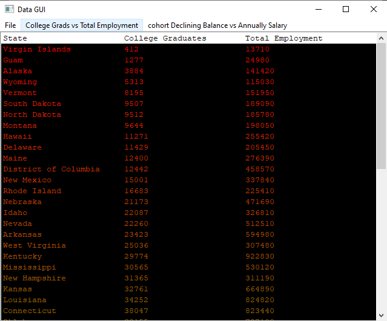

**Manual GUI Test**
--
def test_quit

 - When window loaded, hover over ''file'' tab on the menu bar. If Exit button is pressed, the app should end.

def test_update
- When window loaded, hover over ''file'' tab on the menu bar. 
If the Update button is pressed, the app should present the
following input window

- enter file name with extension. If the ok button is pressed, the app will freeze for a second
while loading before resuming normal function. The data visible in the app will be updated
with the file entered.

def test_display_data_list_one
- When window loaded, hover over ''College Grads vs Total Employment'

 
 
 - If the "Ascending Number College Grads" button is pressed, a list of number of college
 grads and number of total employment for each state and territory, like the following, will be displayed.
 
 
 
 - the first item of the list should have less college grads than the second. The list should also
 have a color gradient of red to green.
 
 def test_display_data_map_one
 - When window loaded, hover over ''College Grads vs Total Employment'.
  
  
  
  - If "choropleth map" button is pressed, a choropleth map should appear 
  within the window, like the following 
  
  
  
  - This should map should have a title "# Employees / # College Grads", 
  and can be manipulated within the window.
  
  def test_display_data_list_two
- When window loaded, hover over ''Cohort declining Balance vs Annual Salary'

 
 
 - If the "Ascending Lower 25 percent Salary" button is pressed, a list of the average lower 25 percent salary and average declining balance for each state and territory, like the following, will be displayed.
 
 
 
 - the first item of the list should have a lower average salary than the second. The list should also
 have a color gradient of red to green.
 
 def test_display_data_map_two
 - When window loaded, hover over ''Cohort declining Balance vs Annual Salary'.
  
  
  
  - If "choropleth map" button is pressed, a choropleth map should appear 
  within the window, like the following 
  
  
  
  - This should map should have a title "Lower 25% Salary / Declining Balance", 
  and can be manipulated within the window.